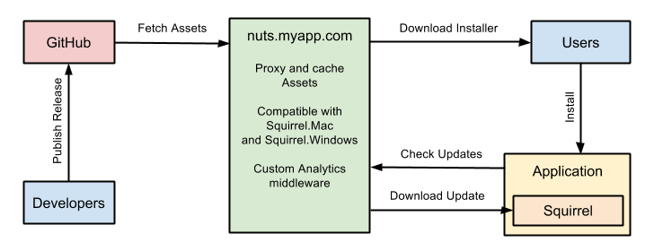

# Nuts Documentation

Nuts is a simple (and smart) application to serve desktop-application releases.

It uses GitHub as a backend to store assets, and it can easily be deployed to Heroku as a stateless service. GitHub private repositories are supported (useful to store releases of a closed-source application available on GitHub).

Please make sure that you use the documentation that match your Nuts version (Latest version is **{{ book.version }}**).

### FAQ

There are questions that are asked quite often, [check this out before creating an issue](faq.md).

### Help and Support

We're always happy to help out with any questions you might have. You can ask a question or signal an issue on [GitHub](https://github.com/GitbookIO/nuts/issues).

### Guides

We've created a few guides to help you getting started:

- [Deploy Nuts](deploy.md)
- [Upload release's assets](assets.md)
- [Setup GitHub integration](github.md)
- [Setup OS X Auto-Updater](update-osx.md)
- [Setup Windows Auto-Updater](update-windows.md)
- [Debug API](api.md)
- [Use it as a Node.js middleware](module.md)

----

Using Nuts for your application? [Add it to the list](using-it.md).
